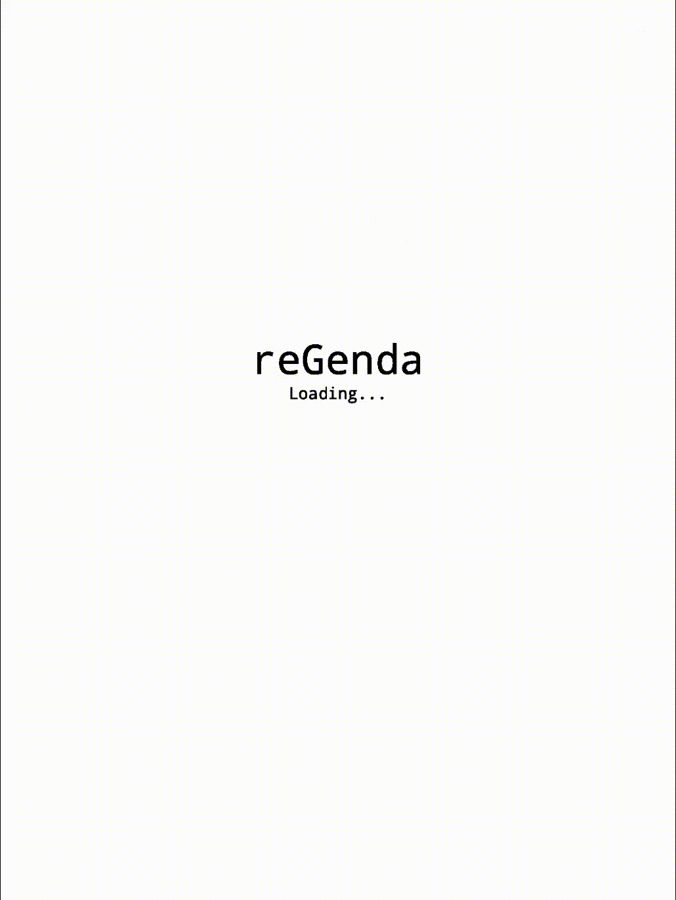

# reGenda - Agenda app for reMarkable

reGenda is **read only** (for now) agenda app for reMarkable tablets. I would like to add edit features, but it's in the future.

**Currently, reGenda only works with caldav servers that require login, such as [Nextcloud](https://nextcloud.com/) (only tested with Nextcloud so far). Other calendars specified by url or Google calendar for example are not supported and I don't guarantee they will be, but I know they might be more attractive to others.**

## What it can do

- Show your day based agenda
- Show event details
- Show events from multiple calendars (but not from multiple servers)
- You can choose what calendar will be displayed
- You can choose language of UI (only English and Czech are currently supported)
- Fast time travel by selecting day from month based view
- Fast return to today

Maybe more, check preview or try it your self.

## Preview



# Installation

## From toltec

Currently in testing branch

## From prebuild package for toltec (will be removed when it will be added to toltec)

Check [releases](https://github.com/tenJirka/reGenda/releases) and download package to your reMarkable, then install it via:

```bash
opkg install "path to package"
```

All dependencies will be installed automatically, but **see Configuration section to set up your server.**

## Manually

You will probably not be able to install all dependencies if you do not have installed toltec on your reMarkable.

### Dependencies

- git
- python3
- python3-pip
- python3-lxml
- simple
- display (for reMarkable 2)

Can by installed by:

```bash
opkg install git python3 python3-pip python3-lxml simple # display
```

### Installation

1. Download repository to directory of your choice:

   ```bash
   git clone https://github.com/tenJirka/reGenda.git
   ```

2. Install python modules:

   ```bash
   cd reGenda
   pip install -r requirements.txt
   ```

3. Create your config file:

   ```bash
   cp config.yml.example config.yml
   ```

4. **Edit your config file - see configuration section in this README.**

5. Move config file to it's place:

   ```bash
   mkdir -p /opt/etc/reGenda
   mv config.yml.example /opt/etc/reGenda/config.yml
   ```

6. Run reGenda:

   ```bash
   chmod +x run.py
   ./run.py
   ```

### Update

```bash
cd "reGenda dir"
git pull
```

## Configuration

Server that reGegenda communicates with can't be set up from UI, so you **have to** edit config file before using it.

This should be necessary to do only once.

Config file destination should be  `/opt/etc/reGenda/config.yml`. Default location of example config file is `/opt/etc/reGenda/config.yml.example`.

If you are installing from package, post install script will create config file for you if not exists yet, but you have to fill informations about your server and your user.

You can do this by this command:

```bash
nano /opt/etc/reGenda/config.yml # or different text editor like vim
```

Your configuration file should look like this:

```yaml
server:
  url: "caldav url"
  user: "user name"
  password: "user password"
```

## FAQ

Maybe this section should be named "Things I would like you to knew", but it wont be so attractive, so…

### Why is it so slow?

reGenda don't save any informations to device, so wherever you change date, it have to download events first.

If the app launch is very slow it can depends on multiple things.

- Your server can be slow
- Your Internet connection can be slow
- Try charge up your remarkable, I have suspicion that it can have impact on lunch time, not sure why

Lunch takes around 10 seconds to me, but I experience one day when it takes slightly below 40, and I wasn't able to find out why. Lunch time changes even when trying different account on same server.

### Why is Czech supported language

Because I'm from Czechia and Czech is matter of the heart for me, so the app was originally only in Czech, English was added later before publishing.

### Why is CalDav supported instead of Google calendar

That's because I  developed reGenda for my self originally and I use CalDav. It would be impractical develop app that I can't use.

### I would like to develop apps for reMarkable tablet too, how?

You should checkout [remarkable.guide]( https://remarkable.guide/) at first place.

reGenda uses by me written [Simple](https://rmkit.dev/apps/sas) wrapper for Python that you can find [here](https://github.com/tenJirka/rm-pySAS), or you can check similar Python module that I didn't know already exists [Carta](https://github.com/Jayy001/Carta).

## Credits

- [caldav](https://github.com/python-caldav/caldav) - Module used to communicate with servers
- [rmkit](https://rmkit.dev/) - Which these app stands on
